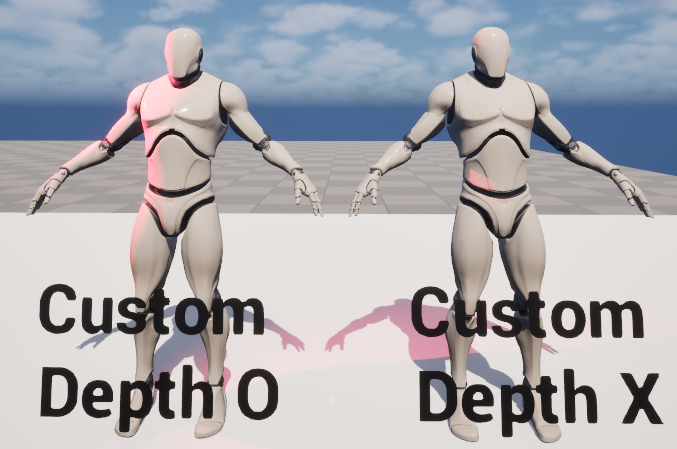
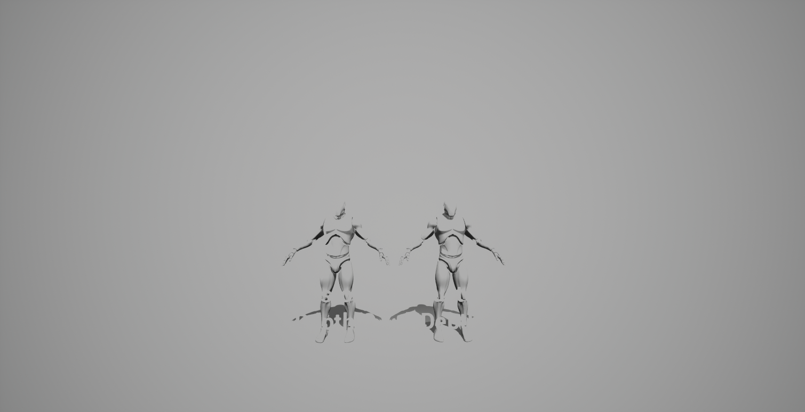
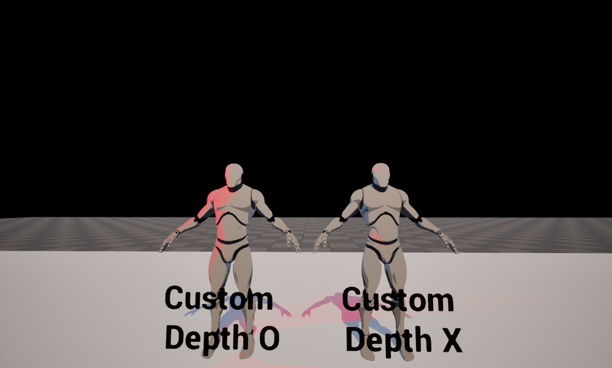
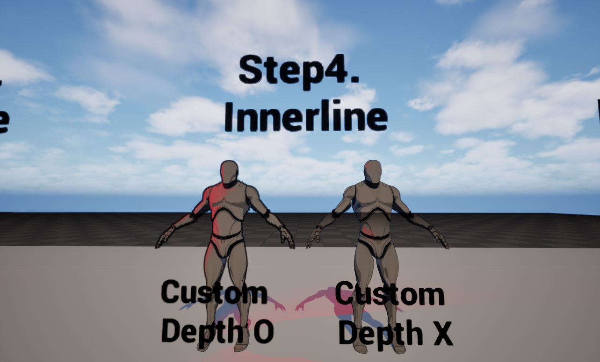
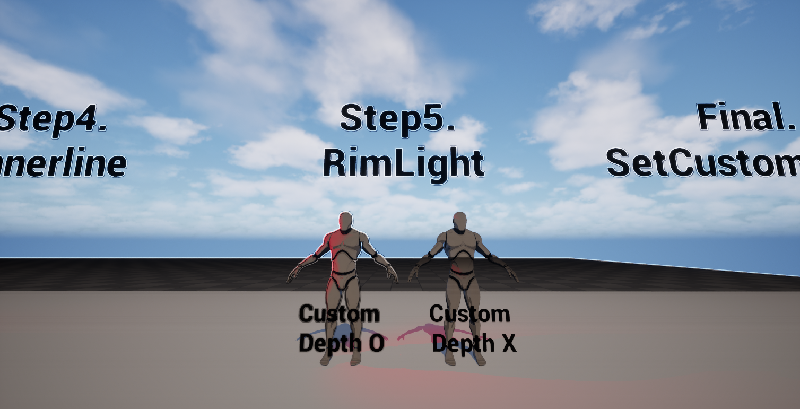
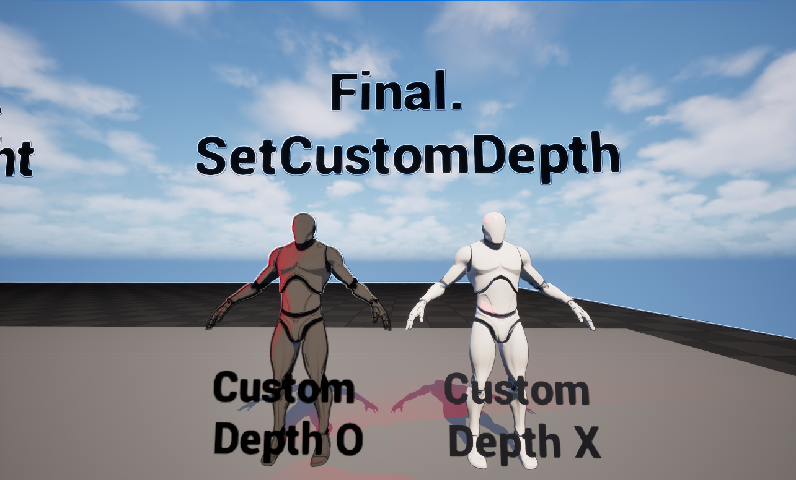

# PostProcess Toon Shader (UE5) — Toon Shading Demo

언리얼 엔진 Post Process Material 기반으로 카툰풍(셀 셰이딩) 스타일을 구현한 것입니다.  
Scene Color에 '톤 분할(Toon Ramp)'을 적용하고, Depth/Normal 기반 '엣지 감지'로 아웃라인을 합성합니다.

---

## Preview

### Original

### Step1. GrayScale

### Step2. Base Color/Shadow

### Step3. Outline

### Step4. Innerline

### Step5. Rim Light

### Fanal. Set Custom Depth

---

## Features

- Post Process 기반 카툰 스타일
- Outline
  - Depth 기반 / Normal 기반 엣지 감지
  - Sobel 필터 기반 경계 강화
- Toon Shading
  - 밝기 구간을 단계화하여 셀 셰이딩 구현
- Modular Material Functions
  - 기능별 MF로 분리

---

## Requirements

- Unreal Engine 5.5+

---

## Included Assets (Core)

| Asset | Type | Purpose |
|------|------|---------|
| `M_PP_Toon` | Material | 최종 PostProcess 머티리얼 (Toon + Outline 합성) |
| `MF_ExtractDepthMap` | Material Function | SceneDepth/Depth 관련 값 추출 & 맵화 |
| `MF_GetNeighbourUVs` | Material Function | 주변 픽셀 UV 계산(커널 샘플링용) |
| `MF_GetOffsetPixel` | Material Function | 오프셋 픽셀 샘플링 유틸 |
| `MF_NormalOutline` | Material Function | Normal 기반 아웃라인/엣지 감지 |
| `MF_SobelFilter` | Material Function | Sobel 커널 기반 엣지 감지 |
| `MF_CombineMap` | Material Function | Depth/Normal/Edge 등 결과 맵 합성 |

---

## Implementation Notes (How it works)

### Outline (Edge Detection)
- [Depth 차이 + Normal 차이]를 이용해 경계선을 찾습니다.
- 엣지 강화를 위해 *Sobel Filter*(3x3 커널)를 사용합니다.
- 주변 샘플링은 `MF_GetNeighbourUVs` / `MF_GetOffsetPixel`로 분리해 재사용 가능하게 했습니다.

### Toon Shading (Quantization)
- Scene Color(또는 조명 관련 값을) 구간화하여 "단계적인 명암"을 만듭니다.
- 단계 수, 대비, 포스터라이즈 강도 등을 파라미터화해서 룩을 쉽게 바꿀 수 있도록 구성하는 것을 권장합니다.

> PostProcess 기반 Toon은 "재질 단위" Toon과 달리  
> "광원/재질 정보의 정밀 제어가 어렵고", 상황에 따라 하이라이트/노이즈가 생길 수 있습니다.  
> 대신 적용이 매우 쉽고 전체 룩을 빠르게 통일할 수 있습니다.
